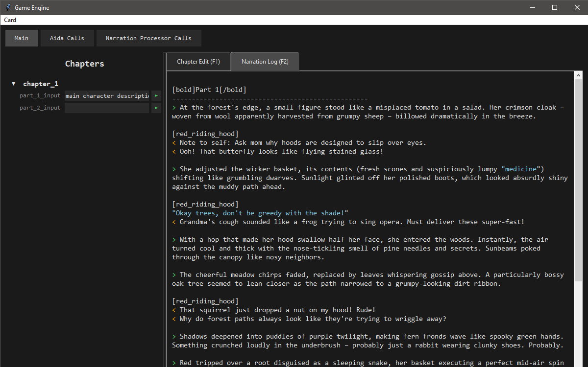

# simple-story-llm

This is a simple GUI app that helps creating stories using an LLM (deepseek r1).
If you've read about "Aida", it's a placeholder name I used for the LLM. You can say it's an "AI Director Assistant".

1. Install requisites. You can use UV.
2. Set DEEPSEEK_API_KEY env
3. Run main_gui.py
4. Click on a chapter name to edit the chapter details and see the logs
5. Right click a chapter to generate the whole sequence

You might want to edit the prompt used to generate the text. Go to src/system/aida/simple_prompt.md and edit it. The only important part is the <NARRATION_LOG></NARRATION_LOG> section.

## Extra

You can check the progress of the generation in the view "Aida Calls".
Similarly, you can check the extracted facts in "Narration Processor Calls". These are data used to generate parts without giving the LLM the entire generated log.

# Contact

https://lit.link/en/minra

# License

MIT License

Copyright (c) 2025 minra-illust

Permission is hereby granted, free of charge, to any person obtaining a copy
of this software and associated documentation files (the "Software"), to deal
in the Software without restriction, including without limitation the rights
to use, copy, modify, merge, publish, distribute, sublicense, and/or sell
copies of the Software, and to permit persons to whom the Software is
furnished to do so, subject to the following conditions:

The above copyright notice and this permission notice shall be included in all
copies or substantial portions of the Software.

THE SOFTWARE IS PROVIDED "AS IS", WITHOUT WARRANTY OF ANY KIND, EXPRESS OR
IMPLIED, INCLUDING BUT NOT LIMITED TO THE WARRANTIES OF MERCHANTABILITY,
FITNESS FOR A PARTICULAR PURPOSE AND NONINFRINGEMENT. IN NO EVENT SHALL THE
AUTHORS OR COPYRIGHT HOLDERS BE LIABLE FOR ANY CLAIM, DAMAGES OR OTHER
LIABILITY, WHETHER IN AN ACTION OF CONTRACT, TORT OR OTHERWISE, ARISING FROM,
OUT OF OR IN CONNECTION WITH THE SOFTWARE OR THE USE OR OTHER DEALINGS IN THE
SOFTWARE.
